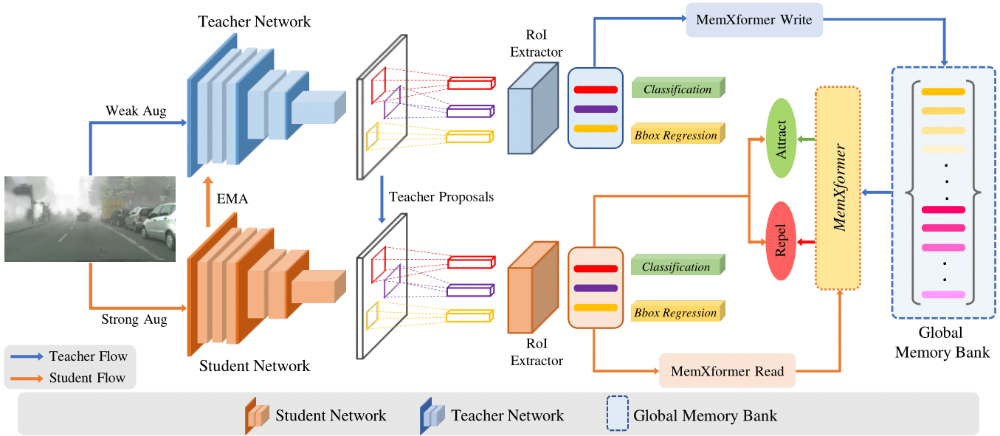

# Online-DA Object Detection

Official Pytorch Code base for [Towards Online Domain Adaptive Object Detection](https://arxiv.org/abs/2203.15793)

[Paper](https://arxiv.org/abs/2203.15793) | [Project page] - Coming soon...!!!

## Introduction

Existing object detection models assume both the training and test data are sampled from the same source domain. This assumption does not hold true when these detectors are deployed in real-world applications, where they encounter new visual domain. Unsupervised Domain Adaptation (UDA) methods are generally employed to mitigate the adverse effects caused by domain shift. Existing UDA methods operate in an offline manner where the model is first adapted towards the target domain and then deployed in real-world applications. However, this offline adaptation strategy is not suitable for real-world applications as the model frequently encounters new domain shifts. Hence, it becomes critical to develop a feasible UDA method that generalizes to these domain shifts encountered during deployment time in a continuous online manner.
   To this end, we propose a novel unified adaptation framework that adapts and improves generalization on the target domain in online settings. In particular, we introduce MemXformer - a cross-attention transformer-based memory module where items in the memory take advantage of domain shifts and record prototypical patterns of the target distribution. Further, MemXformer produces strong positive and negative pairs to guide a novel contrastive loss, which enhances target specific representation learning.
   Experiments on diverse detection benchmarks show that the proposed strategy can produce state-of-the-art performance in both online and offline settings.
   To the best of our knowledge, this is the first work to address online and offline adaptation settings for object detection.

  

## Code
Coming Soon...!!!
